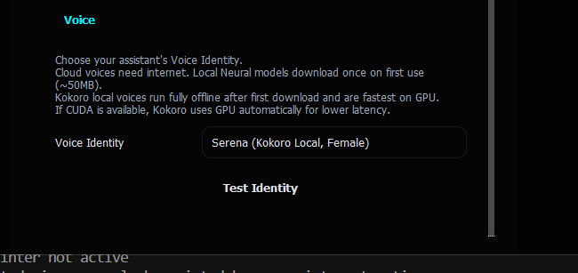
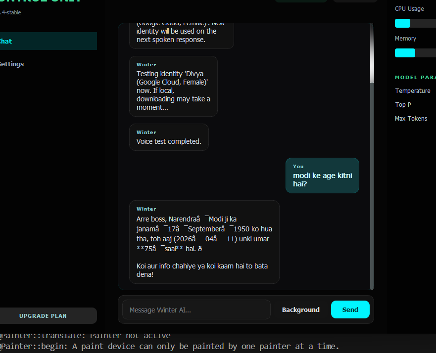
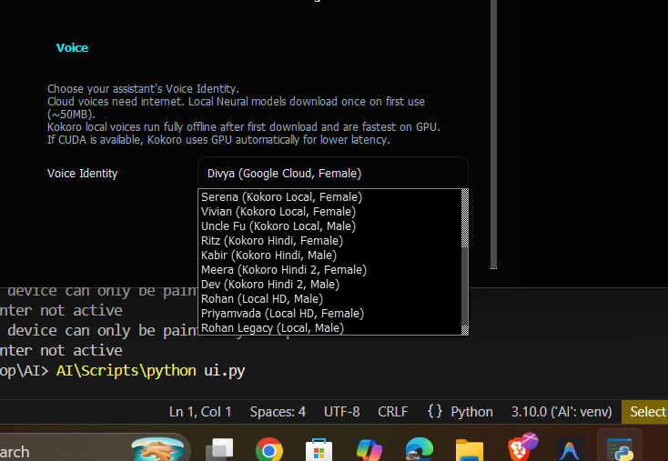

<div align="center">


<br/>

# ❄️ Winter AI Assistant

**A premium desktop AI assistant with natural Hindi/Hinglish conversation, live web intelligence, and multi-engine voice synthesis.**

<br/>

[](https://python.org)
[](https://pypi.org/project/PyQt5/)
[](https://groq.com)
[](LICENSE)

</div>

---

## 🧭 What is Winter AI?

**Winter** is a fully featured **offline-first desktop AI assistant** built in Python. It combines the speed of a Groq-hosted LLM (like LLaMA 70B) with an intuitive dark-mode GUI built using PyQt5.

It's designed for **Indian users** — fluently understanding **Hindi, Hinglish, and English**, responding naturally in casual conversation, and switching seamlessly between live web queries and offline intelligence.

> Think of it as a personal Jarvis on your desktop — conversational, intelligent, and voice-enabled.

---

## ✨ Core Capabilities

| Feature | Description |
|---|---|
| 🗣️ **Hindi/Hinglish Chat** | Natural casual conversation in Hindi, Hinglish, or English |
| 🌐 **Live Web Intelligence** | Real-time news, search, and web context injection |
| 🎙️ **Multi-Engine TTS** | Cloud (Edge/Google) + Offline (Piper HD/Kokoro) voices |
| 🧠 **Persistent Memory** | Short + long-term memory with profile-based personalization |
| 🖥️ **System Automation** | Open files/apps, manage folders, rename files |
| 📄 **Export History** | Save conversation to PDF or DOC |
| 🐾 **Background Mode** | Runs quietly in the tray, ready on demand |

---

## 📸 Interface Showcase

<br/>

<table width="100%" border="0" cellspacing="8" cellpadding="0">
  <tr>
    <td width="50%" align="center">
      
      <br/><sub><b>💬 Chat Interface — Natural Hindi/Hinglish Responses</b></sub>
    </td>
    <td width="50%" align="center">
      
      <br/><sub><b>⚙️ Settings Panel — Persona, Memory & Web Controls</b></sub>
    </td>
  </tr>
</table>

<br/>

<div align="center">
  
  <br/><sub><b>🎙️ Categorized Voice Identity Selector — Cloud, HD Local & Fast Local engines</b></sub>
</div>

---

## 🎙️ Voice Engine Architecture

Winter supports **4 tiers of voice engines**, organized by quality and connectivity:

```
☁️  CLOUD VOICES       →  Microsoft Edge Neural (Swara, Neerja, Madhur, Prabhat)
                        →  Google TTS (Divya) — best Hindi pronunciation
─────────────────────────────────────────────────────────────
🎙️  LOCAL HD VOICES    →  Piper ONNX (Priyamvada, Rohan) — offline, ~50MB download
─────────────────────────────────────────────────────────────
⚡  FAST LOCAL VOICES  →  Kokoro ONNX (Serena, Vivian, Ryan) — GPU-accelerated
─────────────────────────────────────────────────────────────
💾  LEGACY VOICES      →  Sherpa-ONNX — backward compatibility
```

> 💡 Cloud voices need internet. Local voices download **once** (~20–50MB) and run **fully offline** after that. If CUDA is available, Kokoro uses GPU automatically.

---

## 🔧 How It Works

```
You type/speak  →  STT (SpeechRecognition + Whisper)
                        ↓
              Intent Detection (Groq API)
                        ↓
         ┌──────────────────────────────┐
         │  Local Action?  →  Run it    │  (open file, create folder...)
         │  Web Query?     →  Fetch it  │  (news, search, live context)
         │  Chat?          →  LLM it    │  (LLaMA 70B via Groq)
         └──────────────────────────────┘
                        ↓
           Stream response to UI (UTF-8 safe)
                        ↓
              TTS Engine speaks it out
```

---

## 🛠️ Setup & Installation

### Prerequisites
- Python **3.10+**
- A free [**Groq API Key**](https://console.groq.com/)
- Windows / Linux / macOS

### Step 1 — Clone the Repository

```bash
git clone https://github.com/dhruvbhaskar07/Winter-AI-Assistant.git
cd Winter-AI-Assistant
```

### Step 2 — Run Setup Script

**Windows:**
```bat
scripts\1_WINDOWS_SETUP.bat
```

**Linux / macOS:**
```bash
bash scripts/2_LINUX_SETUP.sh
```

### Step 3 — Configure Environment

```bash
cp .env.example .env
```

Open `.env` and fill in your key:
```env
API_KEY=your_groq_api_key_here
ASSISTANT_NAME=Winter
ASSISTANT_BOSS_NAME=Boss
```

### Step 4 — Launch

```bash
python ui.py       # Graphical UI
python main.py     # CLI / Voice mode
```

---

## 📁 Project Structure

```
Winter-AI-Assistant/
├── ui.py                         # Desktop UI entry
├── main.py                       # CLI/Voice entry
├── requirements.txt              # Python dependencies
├── .env.example                  # Environment template
│
├── assets/                       # UI screenshots
│
├── scripts/
│   ├── 1_WINDOWS_SETUP.bat
│   ├── 2_LINUX_SETUP.sh
│   └── 3_MACOS_SETUP.command
│
└── src/
    ├── ui_app.py                 # PyQt5 GUI & workers
    ├── cli_main.py               # Voice/terminal loop
    │
    ├── modules/
    │   ├── command_handler.py    # Intent routing
    │   ├── system_control.py     # Open app/file
    │   └── automation.py        # File automation
    │
    ├── services/
    │   ├── llm_service.py        # Groq API + streaming
    │   └── live_info_service.py  # Web/news fetch
    │
    └── utils/
        ├── voice.py              # STT + TTS manager
        ├── memory.py             # Persistent memory
        └── personas.py           # Persona profiles
```

---

## ⚙️ Environment Variables

| Variable | Description | Default |
|---|---|---|
| `API_KEY` | Groq API key (required) | — |
| `LLM_MODEL` | Main LLM model | `llama-3.3-70b-versatile` |
| `ASSISTANT_NAME` | Assistant display name | `Winter` |
| `TTS_CHARACTER` | Active voice profile | `☁️ Neerja (Edge Expressive, Female)` |
| `STT_PROFILE` | Mic mode (`near`/`far`/`balanced`) | `balanced` |
| `KOKORO_ONNX_PROVIDER` | GPU engine (`auto`/`CUDAExecutionProvider`) | `auto` |

---

## 🧪 Example Conversations

```
You:    latest tech news batao
Winter: Sure boss, yeh raha aaj ka latest...

You:    organize my downloads
Winter: Downloads folder clean kar diya. 12 files sorted!

You:    kya scene hai? kaise ho?
Winter: Sab theek boss! Kuch kaam karna hai ya bas baat karni hai?

You:    create folder on desktop named Projects
Winter: Done! "Projects" folder desktop pe bana diya.
```

---

## 🔍 Troubleshooting

| Issue | Fix |
|---|---|
| Voice not working (Windows) | `pip install pipwin` then `pipwin install pyaudio` |
| Edge TTS error (403) | App auto-falls back to Google TTS |
| Local voice slow first time | Downloading model (~50MB). Only happens once. |
| Hindi text looks corrupted | Ensure your terminal/font supports UTF-8 / Devanagari |

---

<div align="center">

Made with ❤️ by **Dhruv Bhaskar**
<br/>
⭐ Star this repo if you like it!

</div>
